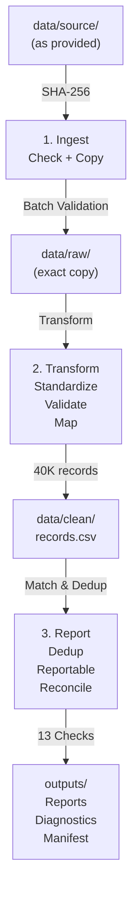

# Training Reporting Pipeline

## Overview

This pipeline ingests five training data sources (3 CHW workbooks, 1 in-person/webinar capture, 1 online export), applies deterministic validation and mapping, deduplicates participants, and produces reconciled reports with 13 verification checks.

**Headline Metric**: 30,195 reportable completions across 16,743 distinct participants (38,102 total enrolments). All 13 reconciliation checks passing.

### Architecture at a Glance



---

## Quick Start

### Prerequisites
- **Python 3.10+**
- Virtual environment (recommended)

### Setup

```bash
python -m venv .venv
# Windows:      .venv\Scripts\activate
# macOS/Linux:  source .venv/bin/activate
pip install -r requirements.txt
```

### Provide the Source Data

Training data is not committed to Git. Copy the provided files into `data/source/` following the structure below:

```
data/source/
├── Online Data Export 17 Dec_SCRUBBED.csv
├── Capturing Tool_V1c V2-27 January 2026_SCRUBBED.xlsx
├── Course and Facility Look Ups.xlsx
└── Community Health Worker Completions/
    ├── CHW Training Attendance-West Coast-Oct 2025_SCRUBBED.xlsx
    ├── CHW Training Attendance_KESS_December 2025_SCRUBBED.xlsx
    └── WITZENBERG - July-Dec 2025_SCRUBBED.xlsx
```

---

## Running the Pipeline

```bash
# Full run: ingest -> transform -> report
python src/pipeline.py

# Rebuild from data/raw/ only (skip ingest, useful for testing and reruns)
python src/pipeline.py --from-raw
```

**Execution details:**
- Logs written to: `data/logs/pipeline_YYYYMMDDTHHMMSSZ.log`
- **Exit codes:** 
  - `0` = Success
  - `1` = Validation or reconciliation check failed (expected failure)
  - `2` = Unexpected error
- **Idempotent:** Re-running on the same input produces byte-identical outputs

### Input Validation

The pipeline stops before landing any files if a source is invalid:
- Missing, empty, or unreadable
- Missing required sheets or columns
- No data rows
- Missing module titles above date columns

> All issues are checked and listed together in one run. You see everything that needs fixing at once.

---

## Outputs

All outputs are written to `outputs/`. Committed files are tracked in Git and others are regenerated per run.

### Reports & Reconciliation

| File | Purpose | Status |
|------|---------|--------|
| `reports/completions_by_district.csv` | Completions, not completed & enrolments per district with totals | Committed |
| `reports/participants_vs_completions_vs_enrolments.csv` | Distinct participants and completions per source | Committed |
| `reconciliation/reconciliation_checks.csv` | 13 data-quality checks (expected vs. actual vs. PASS/FAIL) | Committed |

### Diagnostics & Audit Trail

| File | Purpose | Status |
|------|---------|--------|
| `diagnostics/dedup_summary.csv` | Record funnel: reportable + quarantined + excluded + duplicate per source | Committed |
| `diagnostics/unmapped_values.csv` | All unmapped courses/facilities/districts with source file, sheet, row & record ID | Committed |
| `diagnostics/quarantine_records.csv` | Records that failed validation (Q01-Q06) with rule IDs & location | Committed |

### Metadata & Logs

| File | Purpose | Status |
|------|---------|--------|
| `metadata/run_manifest.json` | Run ID, status, input/mapping SHA-256 hashes, counts & stage timings | Committed |
| `metadata/pipeline_YYYYMMDDTHHMMSSZ.log` | Timestamped execution log (new file per run) | Gitignored |

### Clean Layers (Internal)

| File | Purpose | Status |
|------|---------|--------|
| `data/clean/records.csv` | One row per record with all mapped values & `*_match` columns | Gitignored |
| `data/clean/reportable_records.csv` | Clean layer + participant key, match tier & exclusion reason | Gitignored |

### Column Naming Conventions

```
_count     = Additive record counts (rows sum to TOTAL)
_distinct  = Distinct participant counts 
```

### Example: Data Quality at a Glance

```
Example: Headline = 30,195 completions
├── 38,102 total enrolments
├── 16,743 distinct participants
├── 35 quarantined records (validation failures)
└── 13/13 reconciliation checks PASS
```

---

## Testing & Verification

### Unit Tests

Test have not been fully developed and will be added in the future.
The `tests/` directory has not been included yet.

### Idempotency Verification

```bash
# Verify outputs are byte-identical across runs
python scripts/check_idempotency.py
```

This script:
1. Runs the pipeline from `data/source/`
2. Reruns the pipeline on the same data
3. Runs with `--from-raw` to skip ingest
4. Confirms 9 outputs are byte-identical across all 3 runs

---

## Repository Structure

```
training-reporting-pipeline/
├── README.md                          
├── requirements.txt                   # Python dependencies
├── .gitignore                         # Excludes data layers & generated artifacts
│
├── src/
│   ├── config.py                      # Paths, source definitions, business rules
│   ├── ingest.py                      # Step 1: Check & copy files to data/raw/
│   ├── transform.py                   # Step 2: Standardise, validate, map
│   ├── report.py                      # Step 3: Participant matching, dedup, reports
│   └── pipeline.py                    # Main orchestration and logging for pipeline
│
├── mappings/
│   ├── course_aliases.csv             # Fuzzy-match corrections (e.g. typos)
│   └── district_aliases.csv           # District name normalizations
│
├── scripts/
│   └── check_idempotency.py           # Verify byte-identical outputs
│
├── tests/                             # (Gitignored) To be developed
│   └── (Unit tests planned for future)
│
├── docs/
│   └── design.md                      # Detailed architecture & design decisions
│
└── data/                              # (All gitignored; created on first run)
    ├── source/                        # Your training data files (provide)
    ├── raw/                           # Copies of source files (landed by ingest)
    ├── clean/                         # Standardized records & reportable output
    ├── logs/                          # Timestamped pipeline logs
    └── (plus outputs/ with reports)
```

---

## Configuration & Customization

### Adding or Fixing Aliases

1. **Course aliases:** Add row to `mappings/course_aliases.csv`
   ```
   source_key,course_name
   intrdouction to data,Introduction to Data
   ```

2. **District aliases:** Add row to `mappings/district_aliases.csv`
   ```
   source_key,district
   Mero,Metro
   ```

3. Run the pipeline and aliases are applied at transform time.


### Excluding Test/Internal Records

Add keywords to `TEST_INTERNAL_KEYWORDS` in `src/config.py`:

```python
TEST_INTERNAL_KEYWORDS = ("test", "dummy", "internal")
```

---

## Design & Architecture

For detailed information on:
- **Architecture & data layers** — See [docs/design.md](docs/design.md)
- **Validation rules** — See [docs/design.md#validation](docs/design.md) (Q01-Q06)
- **Participant matching & deduplication** — See [docs/design.md#deduplication](docs/design.md)
- **Reconciliation framework** — See [docs/design.md#reconciliation](docs/design.md)
- **Alias maintenance workflow** — See [docs/alias_maintenance.md](docs/alias_maintenance.md)
