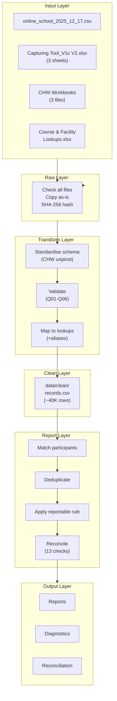
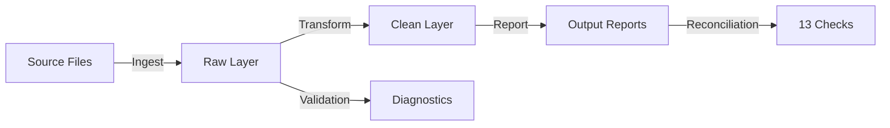
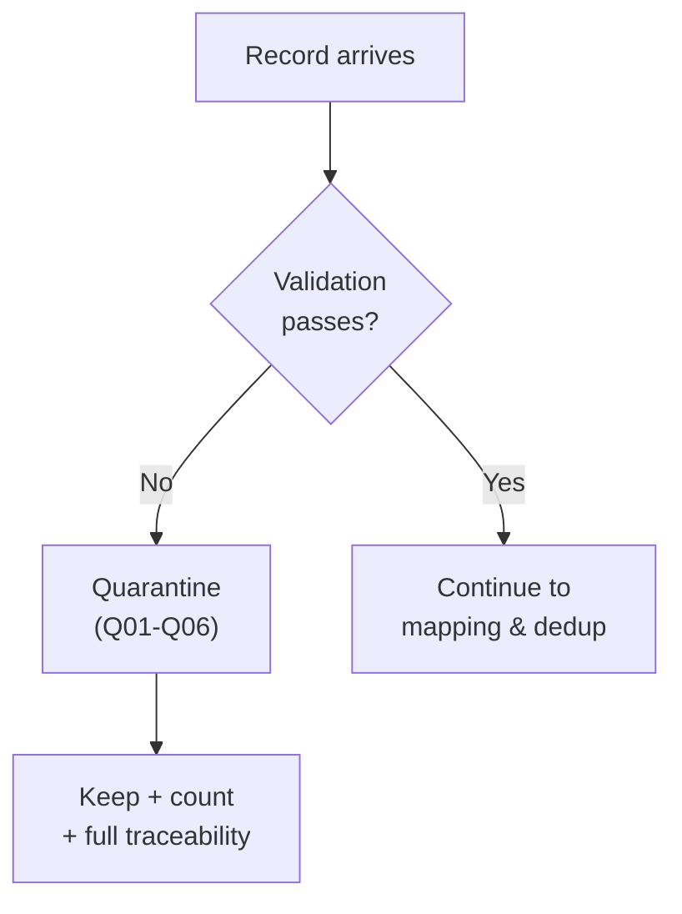
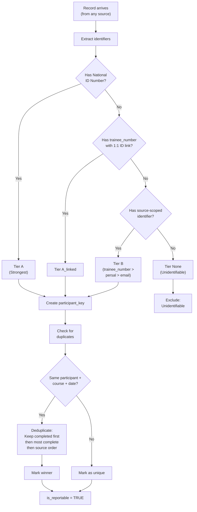

# Architecture & Design

## 1. Data Layers & Orchestration

### Step-by-Step Breakdown

| Step | Module | Reads | Writes | Purpose |
|------|--------|-------|--------|---------|
| **Ingest** | `src/ingest.py` | `data/source/` | `data/raw/` | Validate all files, copy byte-for-byte, record SHA-256 hashes |
| **Transform** | `src/transform.py` | `data/raw/` | `data/clean/records.csv` | Standardize schema, validate rows (Q01-Q06), map to lookups & aliases |
| **Report** | `src/report.py` | `data/clean/` | Reports + Diagnostics | Match participants, deduplicate, apply reportable rule, reconcile |
| **Orchestration** | `src/pipeline.py` | - | Logs, manifest | Run steps in sequence, optional `--from-raw` if you want to rerun without ingesting from source again |

### Design Principles

- **Fail Loudly:** All validation errors reported at once, before landing any files
- **Idempotent:** Same input -> byte-identical output (proven by `check_idempotency.py`)
- **Deterministic:** Record IDs are `dataset|sheet|row[|module]` - no run IDs in data
- **Traceable:** Every record keeps source file, sheet, row number, SHA-256 of inputs
- **Publish Only When Safe:** Incomplete reports are deleted if reconciliation checks fail  

### Data Flow

## 2. Reporting Period

The pipeline processes the full period covered by all source files:

| Source | Period | Duration |
|--------|--------|----------|
| Online school | 2022-08-12 to 2025-12-17 | ~3 years |
| In-person/webinar | 2024-10-08 to 2025-12-05 | ~1 year |
| CHW | 2025-02-08 to 2025-12-12 | ~11 months |

**Note:** Online carries significantly more history. time-based analysis filtering would be more useful when comparing sources.

---

## 3. Validation Rules (Quarantine Logic)

### Quarantine Rules Reference

| Code | Rule | Count | Impact |
|------|------|-------|--------|
| **Q01** | Missing course name | 0 | Reported in unmapped_values.csv |
| **Q02** | Missing training date | 12 | Quarantined |
| **Q03** | Date unparseable | 0 | No issues found |
| **Q04** | Date out of range | 4 | Before 2020-01-01 or future |
| **Q05** | Invalid attendance status | 19 | Not in allowed set |
| **Q06** | Invalid booking status | 0 | Not in allowed set |
| | **Total Quarantined** | **35** | Kept + counted |

>> The 35 records experienced in this example are artifacts from a partially incomplete capture on the capture 3 sheet in the Capturing Tool_V1c V2-27 January 2026_SCRUBBED.xlsx document.

**Quarantined records are not dropped.** Every record appears in `outputs/diagnostics/quarantine_records.csv` with reason + location.

---

## 4. Data Quality Challenges

| Challenge | Solution |
|---|---|
| **Data structure varies by source** | Per-source definitions in `config.py`. In-person sheets combined. CHW unpivoted (359 people → 1,112 records). |
| **Date formats inconsistent** | One format per source. Online: text date; Excel: ISO datetime. Result: 0 unparseable dates. |
| **Completion rule differs by source** | Online: `End Date` filled. In-person: `Attendance Status` = Attended or Replacement. CHW: filled module date. |
| **Free-text variants in lookups** | District: 100+ variants. Course names: 565 variants. Use normalised key (case, punctuation removed) + reviewed alias tables. |
| **Missing identifiers** | 141 in-person + 32 CHW records have no ID/persal/email. Excluded as unidentifiable. |
| **Unmapped values** | Top examples: "Optimising Breastfeeding Outcomes" (517), "Khayelitsha District Hospital" (484). Kept in output with full traceability and as an example. |
| **Lookup quirks** | Course codes reused; facility names shared; placeholder has no district. Resolved by matching on name, using reporting names only when unique. |

Mapping coverage, as % of records:

| Field | Coverage |
|---|---|
| Course | 96.2% (34,980 exact match + 2,082 via alias). 1,446 unmapped, 35 missing |
| Facility | 91.5%. 2,543 unmapped, 735 missing |
| District | 93.8%. Every district value present is recognised; 2,405 records have no usable district |

---

## 5. Participant Matching & Deduplication

### Matching Hierarchy

### Completion Rules

| Source | Rule |
|--------|------|
| **Online** | `End Date` is filled |
| **In-person** | `Attendance Status` = `Attended` or `Replacement` |
| **CHW** | Filled module date = 1 completed module |

Result: `enrolments = completed + not_completed`

### Participant Matching

| Tier | Key | Reportable records |
|---|---|---|
| A | national ID number (only identifier present in every source) | 36,984 |
| A_linked | ID borrowed from another row of the same source with the same online trainee number, when that number maps to exactly one ID | 0 in this data |
| B | source-scoped trainee number, then persal, then email (identifies a person within one source only) | 1,118 |
| none | no identifier at all -> `unidentifiable` | (173 excluded) |

Only the system-generated trainee number may lend an ID to another row. Manually captured persal and email values map to more than one ID too often (5.1% and 3.9% of in-person values), so linking on them would merge different people.

**Duplicates.** A duplicate is the same participant, the same course (conformed name) and the same training date, whether within one source or across sources.
- The record kept is the completed one first, then the most complete row, then the first in source order.
- A retake of the same course on a different date counts as a separate completion, by agreed business rule.
- Result: 233 duplicates in 227 groups. None span two sources.

**Reportable rule.** Every record ends with exactly one outcome: reportable, or one `exclusion_reason`, applied in this order of precedence:

| Exclusion reason | Records |
|---|---|
| quarantined | 35 |
| test_internal | 0 (no test records found; KTU staff are real participants; keyword list in config) |
| unidentifiable | 173 |
| duplicate | 233 |
| **reportable** | **38,102** |
| **total** | **38,543** |

**Uncertainty is flagged, not hidden.** `uncertain_matches.csv` lists 36 cases:
- 19 duplicate groups that disagree on completion; the completed record was kept.
- 17 IDs that have more than one online trainee number; they are counted as one person.

**Assumptions and limitations.**
- **Same person, different IDs:** the participant count assumes the ID number was scrubbed consistently across sources. The 1,527 online/in-person overlaps support this. CHW IDs overlap with no other source; this may be genuine, or a sign of different scrubbing.
- **Tier B records may overcount people:** a person identified only by persal or email in one source cannot be linked to their ID elsewhere. 16,743 is therefore an upper estimate of distinct people. Excluding the 173 unidentifiable records pushes the other way.
- **Retakes count separately:** a retake on a different date is a separate completion. Online "not completed" includes people who were approved but never started.
- **Interpretation:** the meaning of `Replacement` was inferred from the data and should be confirmed with the capture team.

---

## 6. Mappings & Maintaining Lookups
- Lookups (`LU_Courses`, `LU_Facility`) are read from the raw layer.
- Reviewed alias tables live in `mappings/`:
  - `course_aliases.csv`: 414 typo variants.
  - `district_aliases.csv`: 151 values mapped to six Western Cape districts, plus `Other / Out of province` and `Unknown / Unmapped`.
- Course aliases were built offline from similarity suggestions, then accepted only if they scored at least 0.85 similarity *and* had identical numbers. This rejected, for example, "Circular H124 list 166" → "list 165". Ambiguous candidates were rejected and left unmapped, for example "Foundational First Aid" → "Foundational CPR".
- Every record carries a `*_match` status (`lookup`, `alias`, `unmapped`, `missing`, …), so nothing silently disappears.
- The run fails if an alias points to a course that is not in the lookup.

**Reproducing historical reports.**
1. **Version everything that defines a rule.** The mapping tables and the code are in git, and the lookups arrive as raw files. The manifest already records the SHA-256 of each input and mapping file. Next, add the git commit to the manifest; a historical report can then be re-run exactly by checking out that commit and replaying the same raw files.
2. **Keep raw immutable and dated.** In production, land raw in date partitions (`data/raw/<ingest_date>/…`) and never overwrite. Old runs can then be replayed against the bytes they used.
3. **Effective-date the mappings.** Give lookup and alias rows `valid_from` / `valid_to` (SCD type 2). `LU_Courses` already has `CourseStartDate`, `CourseEndDate` and `CourseStatus`. A run then has two clear choices:
   - *as-at* reporting: use the mapping versions that were valid on the run date, which reproduces what was reported then;
   - *restated* reporting: use the current mappings over all history.

---

## 7. District & Sub-District Resolution
1. The source `District` value, standardised through `district_aliases.csv`.
2. Otherwise, the district of the matched facility in `LU_Facility` (`HealthDistrict`, standardised the same way).
3. Otherwise `Unknown / Unmapped`.

The record is still counted, so district subtotals always add up to the total.

Sub-district is carried through but not standardised: `sub_district_raw` and `facility_sub_district` are both on every record. It would be derived the same way:
1. Standardise the source value through a sub-district alias table, seeded from the templates' hidden `lu_District` sheet (sub-districts per district) and `LU_Facility.HealthSubdistrict`.
2. Fall back to the facility's sub-district.
3. Add a consistency check that the sub-district belongs to the derived district, and flag conflicts rather than overwrite them.

---

## 8. Reporting & Reconciliation

| district | completions_count | not_completed_count | enrolments_count |
|---|---:|---:|---:|
| Cape Winelands | 4,399 | 1,137 | 5,536 |
| Central Karoo | 584 | 246 | 830 |
| City of Cape Town | 17,236 | 3,820 | 21,056 |
| Garden Route | 3,423 | 989 | 4,412 |
| Overberg | 951 | 333 | 1,284 |
| West Coast | 1,810 | 731 | 2,541 |
| Other / Out of province | 96 | 21 | 117 |
| Unknown / Unmapped | 1,696 | 630 | 2,326 |
| **TOTAL** | **30,195** | **7,907** | **38,102** |

**Report 2 – participants vs completions vs enrolments** (`_distinct` = not additive):

| dataset_key | participants_distinct | completions_count | not_completed_count | enrolments_count |
|---|---:|---:|---:|---:|
| chw_kess_2025_12 | 200 | 444 | 0 | 444 |
| chw_west_coast_2025_10 | 20 | 22 | 0 | 22 |
| chw_witzenberg_2025_07_12 | 100 | 613 | 0 | 613 |
| inperson_webinar_2026_01_27 | 6,455 | 10,638 | 562 | 11,200 |
| online_school_2025_12_17 | 11,495 | 18,478 | 7,345 | 25,823 |
| **TOTAL** | **16,743** | **30,195** | **7,907** | **38,102** |

The source rows of `participants_distinct` sum to 18,270. The TOTAL is 16,743 because it is a distinct count across sources. The difference of 1,527 is exactly the number of people found in both the online and in-person data.

**Why the headline can be trusted.** All 13 checks in `reconciliation_checks.csv` pass:

| Check | What it proves | Result |
|---|---|---|
| R01, R03, R07 | District completions, source completions and both report totals all equal the headline | 30,195 |
| R02, R04 | District and source enrolments sum to the enrolment total | 38,102 |
| R05 | Completed + not completed = enrolments on every row of both reports | PASS |
| R06 | Both reports have the same totals | PASS |
| R08, R09 | Every record has exactly one outcome: reportable + exclusions = 38,543 | PASS |
| R10, R11 | Records equal rows read from raw for each non-CHW source, and no record is lost between transform and report | PASS |
| R12, R13 | Distinct participants <= enrolments, and the TOTAL lies between the largest source and the sum of sources (proves it is not summed) | PASS |

Every excluded record is visible: quarantined rows in `quarantine_records.csv`, unidentifiable and duplicate rows in `reportable_records.csv`, and per-source counts in `dedup_summary.csv`.

---

---

## 9. Future Improvements

1. Resolve top unmapped values with lookup owners

2. Make history reproducible
   - Add git commit SHA to run manifest
   - Partition raw layer by ingest date (never overwrite)
   - Implement effective-dated mappings (SCD type 2)

3. Standardise sub-district with consistency checks

4. Add reporting-period parameter (`--from` / `--to`) applied at `training_date`

5. Load clean layer into star schema for analytics
   - Fact table: `fact_training_record` (record_id, participant_key, course_key, date_key, is_completed, is_reportable)
   - Dimensions: participants, courses, facilities, dates, sources
   - Serves both reports as views

6. Write and add unit tests.

7. Add CI/CD pipeline
   - Run tests on every change
   - Run `check_idempotency.py` before merge
   - Schedule daily orchestration

8. Strengthen data contracts with capture teams
   - Stable Excel templates
   - Enforced pick-lists (district, course, attendance)
   - Mandatory identifiers (ID number)
   - This removes 80% of quality issues upstream

9. Build interactive alias-suggestion tool
   - Reads `unmapped_values.csv`
   - Proposes fuzzy matches with similarity %
   - Operator reviews and approves
   - Auto-adds to mapping tables
   - Generates audit log

---

## 10. Recommended Star Schema

| Table | Contents | Purpose |
|---|---|---|
| `fact_training_record` | `record_id`, participant/course/date/source FKs, `is_completed` (0/1), `is_reportable`, `exclusion_reason` | Core fact; completions = SUM(is_completed) over reportable |
| `dim_participant` | `participant_key`, `match_tier` (A/A_linked/B/None), ID hash | One row per unique participant (SCD1) |
| `dim_course` | Code, name, group, status, `valid_from`/`valid_to` | Course master (SCD2) |
| `dim_facility` | Code, name, district, sub_district, `valid_from`/`valid_to` | Facility master (SCD2) |
| `dim_date` | Date, fiscal year, reporting period, month, quarter | Time dimension |
| `dim_source` | Dataset key, delivery method, file hash, ingest date | Data lineage |

Queries become simple:
- Completions by district: `SELECT district, SUM(is_completed) FROM fact JOIN dim_facility WHERE is_reportable=1 GROUP BY district`
- Distinct participants: `SELECT COUNT(DISTINCT participant_key) FROM fact WHERE is_reportable=1`
- Any reporting period: `WHERE date BETWEEN x AND y`

**Load target:** Postgres for this data size  

---

## 11. Implementation Notes

### Data Quality Insights

- Free-text creates mapping overhead: 100+ district variants and 565 course variants. Enforcing pick-lists at capture time would reduce downstream processing complexity.
- Replacement appears to be a business rule: "Replacement" attendance status is rare (~156 rows) but necessary; it appears to represent substitutes who attended.
- Reporting periods: Online goes back 3 years, in-person ~1 year, CHW ~11 months. Time-based filtering and business questions need to account for source history timeline.

### Design Trade-offs

| Choice | Why | Trade-off |
|--------|-----|------|
| Keep quarantined records | Visibility + traceability avoiding silent data loss | Slightly messy reports (35 rows) |
| Unmapped values in raw name | Transparent and shows what hasn't been configured yet | Inconsistent course/facility names in output |
| Source-scoped tier B matching | Safe avoids false merges on persal/email | Can't deduplicate across sources without ID |
| No fuzzy matching at runtime | Deterministic, configurable and auditable | Requires manual alias maintenance |
| Partition at source rather than date | Schema fits the architecture making it easy to test | Time-based analysis needs a filter |
